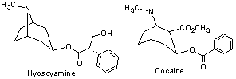

# Notes aka. Dirty Notes

[Monoamine Oxidase Inhibitors](https://en.wikipedia.org/wiki/Monoamine_oxidase_inhibitor) (MAOI) are chemicals which inhibit (prevent form functioning properly) the activity of the monoamine oxidase enzyme family.
Under review are claims of potentially lethal dietary and drug interactions.

Selective serotonin re-uptake inhibitors

CK - Slang for Cocaine (Coke, in Luxembourg some time referred to as Cola or more scientifically: Benzoylmethylecgonine) and Ketamine mixed consumption
[C](https://en.wikipedia.org/wiki/Cocaine) [K](https://en.wikipedia.org/wiki/Ketamine)

[Hyoscyamine](https://en.wikipedia.org/wiki/Hyoscyamine)

[Meow Meow aka Mephedrone](https://en.wikipedia.org/wiki/Mephedrone)

[Substituted amphetamine](https://en.wikipedia.org/wiki/Substituted_amphetamine)

[Amphetamine](https://en.wikipedia.org/wiki/Amphetamine)

Software used to create molecules, [Avogadro](http://avogadro.cc/wiki/Main_Page)

[Ribbon diagram, aka Richardson diagram, some times Cartoon diagram](https://en.wikipedia.org/wiki/Ribbon_diagram)

[Catechol-O-methyl transferase](https://en.wikipedia.org/wiki/Catechol-O-methyl_transferase)

[Python Molecule reaction game](https://github.com/Norberg/molecule)

Brain training with Puzzles. Threshold once getting good at it. Mix it up, stimulation is key.

Emphasize altered states of consciousness talk about the mystery of the mind and that we are fairly unique when it comes to consciousness.

[Lucid Dreaming](https://en.wikipedia.org/wiki/Lucid_dream)
[How To](http://www.wikihow.com/Lucid-Dream)

[Neurohack](http://Neurohack.cc) Thanks @Maijin
[Brain Machine](https://learn.adafruit.com/brain-machine/overview)

/!\ Danger! /!\ [NBOM(b)](https://www.erowid.org/chemicals/2ci_nbome/) [Wikipedia](https://en.wikipedia.org/wiki/25I-NBOMe)

[Adenosine](https://en.wikipedia.org/wiki/Adenosine) builds up throughout the day and binds to receptors, slow downs activity. During sleep Adenosine diminishes. Making you feel less Brain tired.

[Diethyl ether, IUPAC: Ethoxyethane](https://en.wikipedia.org/wiki/Diethyl_ether) [IUPAC Name, chemical name](https://en.wikipedia.org/wiki/Chemical_nomenclature) **IUPAC** == [International Union of Pure and Applied Chemistry](https://en.wikipedia.org/wiki/International_Union_of_Pure_and_Applied_Chemistry)

[Volume rendering](https://en.wikipedia.org/wiki/Volume_rendering)

[Caffeine](https://en.wikipedia.org/wiki/Caffeine) is similar in structure then Adenosine. Caffeine also stimulates [adrenaline](https://en.wikipedia.org/wiki/Epinephrine) Dopamine stimulation. Halflife 6 hours, consume 150mg, 6 hours later only 75mg in Bloodstream.
Give example on receptor over-load (check LoMo link)

[Psilohuasca](http://www.psilohuasca.com/)

[Mescalin](https://de.wikipedia.org/wiki/Mescalin)

[Ibogaine](https://en.wikipedia.org/wiki/Ibogaine)

[Major types of compounds in plants & animals](http://waynesword.palomar.edu/chemid2.htm)

[Science on crack: the Chemistry of illegal drugs, 1](https://puffthemutantdragon.wordpress.com/2012/07/22/science-on-crack-the-chemistry-of-illegal-drugs-1/)

Konkurrenz-denken bei Psychoaktive Stoffer?

Wat ass een [Excipient](https://en.wikipedia.org/wiki/Excipient)?